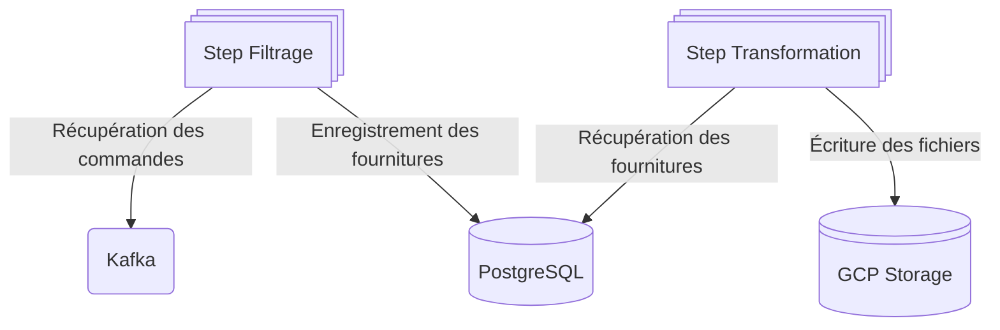

# 🚀 spring-batch-kafka

Repository d'exemple d'application Spring Batch avec intégration:
- Kafka
- PostgreSQL
- GCP Storage

# 👨‍🏫 Description du projet
Ce repo présente plusieurs modules :
> - **application**
>   - Application déployée, elle contient la classe main
>   - Définie le job d'exécution et de ses steps
> - **commande-domain**
>   - Contient uniquement les interfaces et le code propre au domain : 
>     - Comment le filtrage est effectué.
>     - Comment la transformation est effectuée.
>     - Les objets du domain
> - **gcp-storage-writer** :
>   - Adapter implémentant un ItemWriter permettant l'écriture des fichiers
>   - Fourni une configuration des propriétés via le fichier application.yaml
>   - Composant générique n'ayant pas besoin du module commande-domain
> - **kafka-reader** :
>   - Adapter implémentant un KafkaItemReader permettant la consommation d'un topic
>   - Fourni une configuration des propriétés via le fichier application.yaml
>   - Composant générique n'ayant pas besoin du module commande-domain
> - **postgres-reader** :
>   - Adapter implémentant un JdbcPagingItemReader permettant la récupération d'élément dans une base de donnée
>   - Fourni une configuration des propriétés via le fichier application.yaml
>   - Composant générique n'ayant pas besoin du module commande-domain
> - **postgres-writer** :
>   - Adapter implémentant un ItemWriter custom permettant d'écrire l'objet du commande-domain dans une base de donnée
>   - Composant spécifique au métier commande-domain

# 🏎️ Utilisation de l'application

Monter l'infra en local:
```shell
docker compose up
```

# 📊 FLow Chart

# ✍️ RAF
- TU
- TI
- Doc
- Gestion acquittement des messages Kafka en cas d'erreur