# 🚀 spring-batch-kafka

Repository d'exemple d'application Spring Batch avec intégration:
- Kafka
- PostgreSQL
- GCP Storage

# 👨‍🏫 Description du projet
Ce repo présente plusieurs modules :
> - **application**
>   - Application déployée, elle contient la classe main
>   - Définie le job d'exécution et de ses steps
> - **commande-domain**
>   - Contient uniquement les interfaces et le code propre au domain : 
>     - Comment le filtrage est effectué.
>     - Comment la transformation est effectuée.
>     - Les objets du domain
> - **gcp-storage-writer** :
>   - Adapter implémentant un ItemWriter permettant l'écriture des fichiers
>   - Fourni une configuration des propriétés via le fichier application.yaml
>   - Composant générique n'ayant pas besoin du module commande-domain
> - **kafka-reader** :
>   - Adapter implémentant un KafkaItemReader permettant la consommation d'un topic
>   - Fourni une configuration des propriétés via le fichier application.yaml
>   - Composant générique n'ayant pas besoin du module commande-domain
> - **postgres-reader** :
>   - Adapter implémentant un JdbcPagingItemReader permettant la récupération d'élément dans une base de donnée
>   - Fourni une configuration des propriétés via le fichier application.yaml
>   - Composant générique n'ayant pas besoin du module commande-domain
> - **postgres-writer** :
>   - Adapter implémentant un JdbcBatchItemWriter permettant d'effectuer du batch insert en base de données
>   - Composant générique n'ayant pas besoin du module commande-domain

# 🏎️ Utilisation de l'application

Monter l'infra en local:
```shell
docker compose up
```

Ensuite, il sera nécessaire de produire des messages sur le topic appro-event. Pour cela, deux solutions possibles :
- Utiliser le plugin [Kafka](https://www.jetbrains.com/help/idea/big-data-tools-kafka.html) d'Intellij et se baser sur l'exemple [exemple-message.json](exemple-message.json)
- Utiliser la requête HTTP présente dans [request.http](request.http) qui s'appuie sur un conteneur [REST-Proxy](https://docs.confluent.io/platform/current/kafka-rest/api.html)

Vous pourrez alors démarrer l'application qui se chargera d'effectuer le traitement décris ci-dessous 👇

# 📊 FLow Chart

```mermaid
flowchart TD
    B@{shape: procs, label: "Step Filtrage"} --> |Récupération des commandes| A(Kafka)
    B --> |Enregistrement des fournitures| C[(PostgreSQL)]
    D@{shape: procs, label: "Step Transformation"} --> |Récupération des fournitures| C
    D --> |Écriture des fichiers| EA@{ shape: lin-cyl, label: "GCP Storage"}
```


## 🎯 Précisions
🗃️ L'écriture et la mise à jour des entrées en base s'effectue en mode Batch via l'utilisation de la spécialisation JdbcBatchItemWriter.<br/>
📑 La lecture des entrées repose sur l'utilisation d'un JdbcPagingItemReader.<br/>
❌ Les messages Kafka ne sont pas acquittés tant qu'ils n'ont pas été enregistrés dans la base de données.<br/>
👍 Une configuration permet de spécifier l'offset d'une ou des partitions à partir duquel commencer la consommation :
```yaml
batch-kafka:
  reader:
    # Partitions à consommer
    partitions:
      - 0
      - 1
      - 2
    # Nom du processus utilisé pour le suivi dans les tables Spring Batch
    process-name: retrieveCommande
    # Durée maximum d'attente après la consommation du dernier message avec de passer au step de transformation
    poll-timeout: 5
    # Topic de lecture
    topic: appro-event
    # Facultatif, permet de spécifier les offsets des partitions consommées (rejeu)
    partition-offset:
      - offset: 0
        partition: 0
      - offset: 0
        partition: 1
      - offset: 0
        partition: 2
```
📘 La description des propriétés custom est expliquée dans le fichier [CONFIGURATION.md](CONFIGURATION.md)

# 🧑‍🏫 Bonnes pratiques

- ❌ Ne pas gérer manuellement les transactions
- ✅ Utiliser les spécialisations de Spring concernant les interfaces ItemReader / ItemWriter / ItemProcessor
- ✅ Utiliser un découpage par lot (Chunk) et ne pas passer des listes entre ItemReader / ItemProcessor / ItemWriter
- ❌ Ne pas utiliser les listeners pour effectuer un traitement
- ✅ Utiliser les CompositeItemReader / CompositeItemProcessor / CompositeItemWriter pour chaîner plusieurs ItemReader / ItemProcessor / ItemWriter
- ✅ Préférer l'implémentation de plusieurs ItemProcessor effectuant des petites tâches qu'un seul qui ferait plusieurs opérations sensibles
  - 👉 Pour la gestion des transactions et des retry notamment